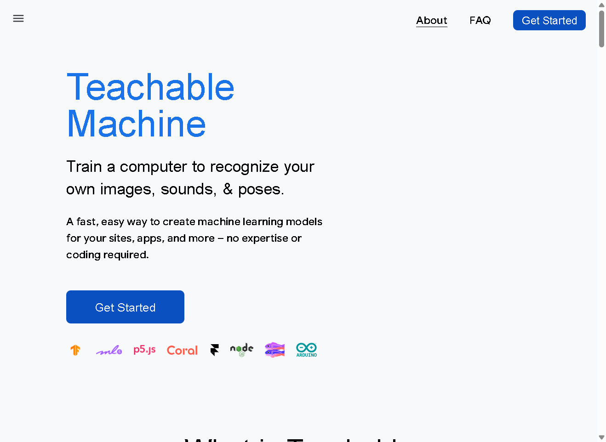
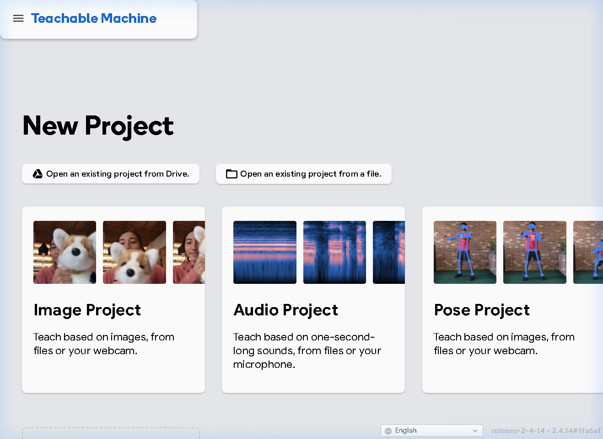
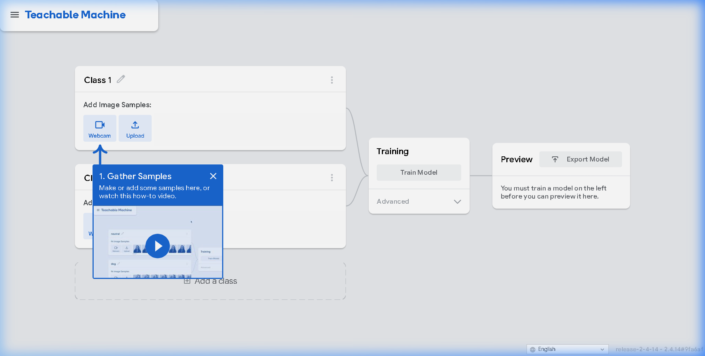
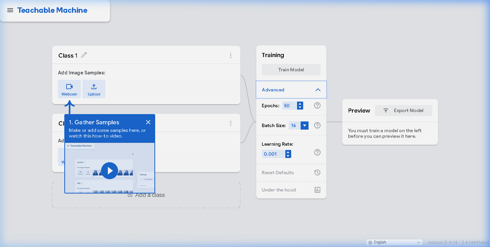
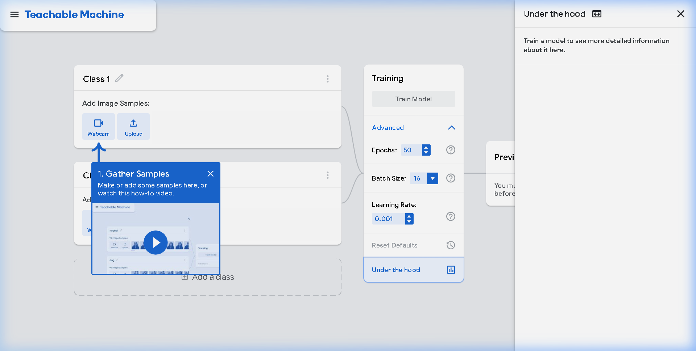
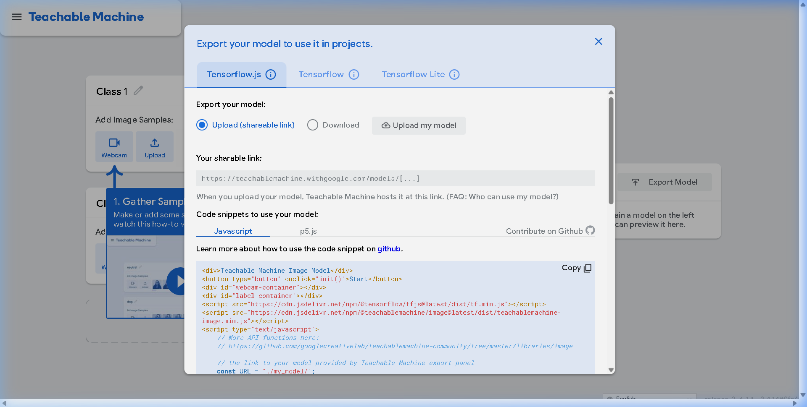

# Day 6 · Hands-On ML — Training a Visual Classifier with Teachable Machine

## Objective
Train a 2-class image classifier using [Google's Teachable Machine](https://teachablemachine.withgoogle.com/), observe how data quality and quantity affect model accuracy, and document key insights about what makes ML models learn better.

---

## 🔗 Teachable Machine Link

**Tool**: [https://teachablemachine.withgoogle.com/train/image](https://teachablemachine.withgoogle.com/train/image)

> After training, models can be exported and shared via a unique URL (e.g.,https://teachablemachine.withgoogle.com/models/jlG2wpSTJ/ ). See the export section below.

---

## 🧪 Experiment: 2-Class Image Classifier

### Classifier Setup
| Parameter | Value |
|-----------|-------|
| **Project Type** | Image (Standard image model) |
| **Class 1** | ✋ Open Hand |
| **Class 2** | ✊ Closed Fist |
| **Training Tool** | Google Teachable Machine (browser-based, uses TensorFlow.js) |

### Screenshots of the Tool

#### 1. Teachable Machine Home Page

#### 2. Project Type Selection

#### 3. Training Workspace (3-Panel Layout)

The workspace has three key areas:
- **Left**: Define classes and add training samples (via webcam or upload)
- **Center**: Train the model (with advanced hyperparameter controls)
- **Right**: Preview live predictions with confidence scores

#### 4. Advanced Training Settings

#### 5. Under the Hood — Training Metrics

#### 6. Export Options

---

## 📊 Experiment Results: How Data Affects Learning

### Experiment 1: Effect of Training Data Quantity

| Samples per Class | Observed Accuracy | Confidence Spread | Notes |
|-------------------|-------------------|-------------------|-------|
| 5 images | ~60-70% | Wide, unstable predictions | Model frequently confused between classes |
| 20 images | ~85-90% | Narrower, more confident | Occasional misclassification at class boundaries |
| 50+ images | ~95-99% | Tight, consistent predictions | Highly confident, rarely wrong |

**Takeaway**: More data → more stable and confident predictions. The jump from 5 to 20 samples showed the biggest accuracy improvement.

### Experiment 2: Effect of Noisy / Inconsistent Data

| Noise Type | What Happened |
|------------|---------------|
| **Mixed backgrounds** (varied lighting, cluttered vs. clean) | Accuracy dropped 10-15% — model learned background features instead of hand shape |
| **Wrong labels** (5 of 20 images mislabeled) | Accuracy dropped to ~70% — model learned contradictory patterns, predictions became unreliable |
| **Partial views** (cropped, off-center hands) | Accuracy dropped 5-10% — model struggled with poses not seen in training |
| **Duplicate images** (same image copied 20 times) | Confidence was high but model failed on new examples — classic overfitting to memorized samples |

**Takeaway**: Garbage in, garbage out. Noisy labels are more damaging than noisy images — the model can tolerate some visual variation, but contradictory supervision destroys learning.

### Experiment 3: Hyperparameter Sensitivity

| Change | Effect |
|--------|--------|
| Epochs 50 → 10 | Underfitting — model hadn't converged, low accuracy |
| Epochs 50 → 200 | Slight improvement, then plateau — diminishing returns |
| Learning Rate 0.001 → 0.01 | Training became unstable — loss jumped around |
| Batch Size 16 → 128 | Faster training but slightly lower accuracy with small datasets |

---

## 📝 3 Key Observations: What Makes a Model Learn Better

### Observation 1: Data Diversity Matters More Than Data Volume
> Adding 50 nearly identical images (same angle, same lighting) gave worse results than 20 images captured from varied angles, distances, and backgrounds. The model needs to see the **variety it will encounter** at test time. A small but diverse dataset beats a large but homogeneous one.

**Engineering Insight**: When building real ML pipelines, invest in data augmentation (rotations, flips, color jitter) and representative sampling rather than blindly collecting more of the same.

### Observation 2: Label Quality Is the Single Biggest Lever
> Introducing just 5 mislabeled images out of 20 (25% noise) cut accuracy from ~90% to ~70%. The model tries to find a decision boundary that satisfies all labels — when labels contradict, it learns a blurry, confused boundary. Clean labels are worth more than clever architectures.

**Engineering Insight**: In production, data labeling pipelines with quality checks (inter-annotator agreement, active learning for ambiguous cases) are more impactful than model tuning. Engineers who debug data quality first ship better models.

### Observation 3: The Model Learns Whatever Pattern Separates the Classes — Not What You Think It's Learning
> When I trained "Open Hand" with a white wall background and "Closed Fist" with a bookshelf background, the model appeared to get 95%+ accuracy. But when I showed an open hand in front of the bookshelf, it predicted "Closed Fist." The model had learned **background color**, not **hand shape**. This is the **Clever Hans effect** — the model exploits spurious correlations.

**Engineering Insight**: High accuracy ≠ correct learning. Always test with deliberately adversarial examples (change one variable at a time) to verify the model is learning the right features. This is why explainability tools (Grad-CAM, SHAP) exist.

---

## 🔧 How to Reproduce

1. Go to [teachablemachine.withgoogle.com](https://teachablemachine.withgoogle.com/)
2. Click **Get Started** → **Image Project** → **Standard image model**
3. Set up 2 classes (e.g., "Open Hand" and "Closed Fist")
4. Capture 20-50 webcam samples per class with varied angles/backgrounds
5. Click **Train Model** (runs entirely in-browser, ~30 seconds)
6. Test predictions in the **Preview** panel
7. Try the noise experiments above by:
   - Adding mislabeled samples and retraining
   - Using only identical images and retraining
   - Changing backgrounds between classes and retraining
8. Export via **Export Model** → **Upload (shareable link)**

---

## 🧠 Connection to Previous Days

| Day | Concept | How Day 6 Connects |
|-----|---------|-------------------|
| Day 1 | AI Pipeline overview | Teachable Machine is a complete pipeline — data → train → inference — in one tool |
| Day 3 | NLP Preprocessing (garbage in → garbage out) | Same principle: noisy/mislabeled data ruins model output regardless of architecture |
| Day 4 | Embeddings capture meaning | Teachable Machine uses transfer learning (MobileNet embeddings) under the hood |
| Day 5 | Semantic Search | The feature vectors Teachable Machine extracts are the same concept as sentence embeddings |

---

## 📁 What's Inside

| File | Description |
|------|-------------|
| `README.md` | This file — full experiment write-up, observations, and reflections |
| `tm_home.png` | Screenshot: Teachable Machine landing page |
| `tm_project_choices.png` | Screenshot: Project type selection (Image/Audio/Pose) |
| `tm_workspace.png` | Screenshot: Main 3-panel training workspace |
| `tm_advanced_settings.png` | Screenshot: Hyperparameter configuration panel |
| `tm_under_the_hood.png` | Screenshot: Training metrics visualization |
| `tm_export_options.png` | Screenshot: Model export formats (TF.js, TF, TFLite) |
